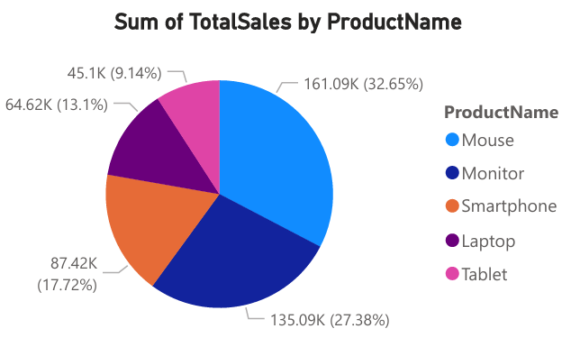
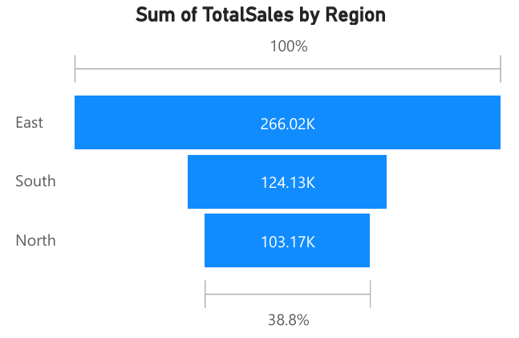
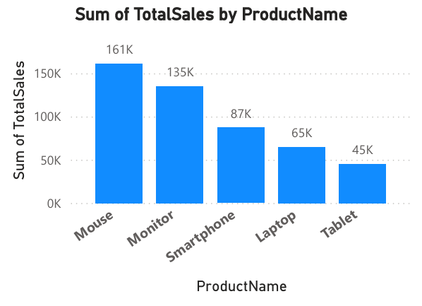

# Power BI — Sales Performance & Customer Insights Dashboard

This project is an interactive Power BI dashboard designed to analyze
product-wise, region-wise, category-wise, and customer-wise sales performance.
The dashboard provides insights into revenue trends, product contribution,
regional distribution, sales vs target performance, and customer buying behavior.

##  Project Overview

- Visualizes Total Sales by Product, Region, Category, Month, and Customer
- Helps understand high-performing products and key revenue-driving regions
- Includes KPI indicators such as:
  - Total Sales
  - Quantity Sold
  - Distinct Customers
  - Average Unit Price
- Supports business decision-making using interactive filters and drill-downs

##  Dataset & Scope

- Dataset Type: Sales transactions dataset (product & customer level)
- Key Dimensions: Product, Region, Category, Customer, Time
- Measures Used: Total Sales, Quantity, Target vs Actual comparison

##  Tools & Techniques

- Power BI Desktop
- DAX Measures
- Data Modeling (Star Schema Concepts)
- Interactive Visualizations & Slicers
- Trend & KPI Analysis

##  Dashboard Insights (Highlights)

- **Product Performance** — Mouse & Monitor contribute the highest sales
- **Regional Sales** — East region has the maximum revenue share
- **Category Split** — Electronics contributes the majority share
- **Sales Trend** — Monthly sales shows declining trend over later months
- **Customer Contribution** — Top customers drive a major share of revenue
- **Target vs Actual** — Sales exceeds defined target threshold

## 📷 Dashboard Preview

### 🟡 Overview Dashboard

### 🔵 KPI & Sales Trend Analysis

### 🟣 Customer & Product Insights

Screenshots available in `/screenshots` folder.

##  View / Download Report

The full dashboard report (PDF export) is available here:  
 `report.pdf`

##  Project Outcome

This dashboard enables business stakeholders to:
- Track revenue performance across multiple dimensions
- Identify key growth regions and products
- Analyze customer purchasing patterns
- Support data-driven decision-making

---

### 👤 Author
Rahul Kumar Sharma  
